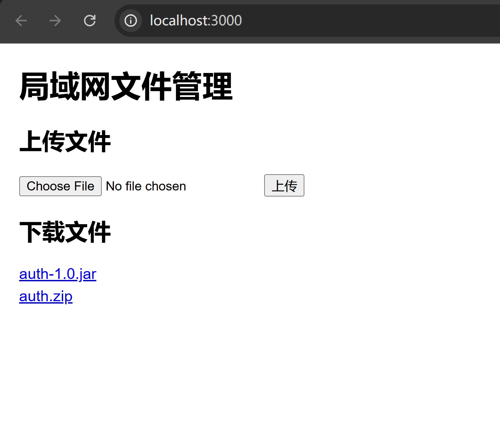

# LanFileManager

[Click here for English Version](./README_EN.md)

---

这是一个简单的局域网文件管理服务，您可以通过局域网上传文件，并在其他设备上通过浏览器下载这些文件。

### 功能

- 文件上传
- 文件下载
- 局域网文件共享

### 安装

首先，确保你已经安装了 [Node.js](https://nodejs.org)。

1. 克隆项目代码：
   ```bash
   git clone https://github.com/yourusername/LanFileManager.git
   cd LanFileManager
   ```

2. 安装依赖：
   ```bash
   npm install
   ```

3. 启动服务器：
   ```bash
   npm start
   ```

4. 在浏览器中打开 [http://localhost:3000](http://localhost:3000)。

### 使用

- **上传文件**：使用 Windows 上传文件。
- **下载文件**：在 iPad 等设备上，通过局域网访问服务器并下载文件。

### 示例


